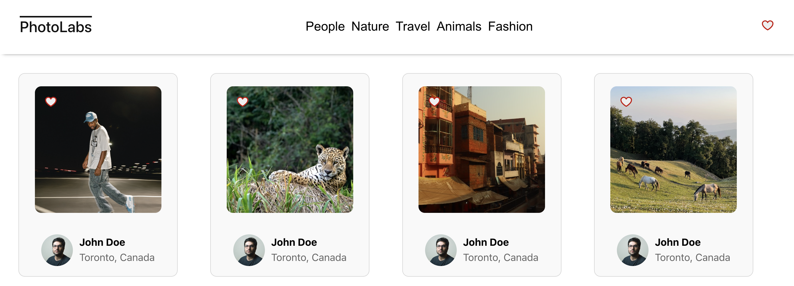
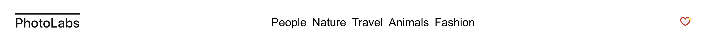
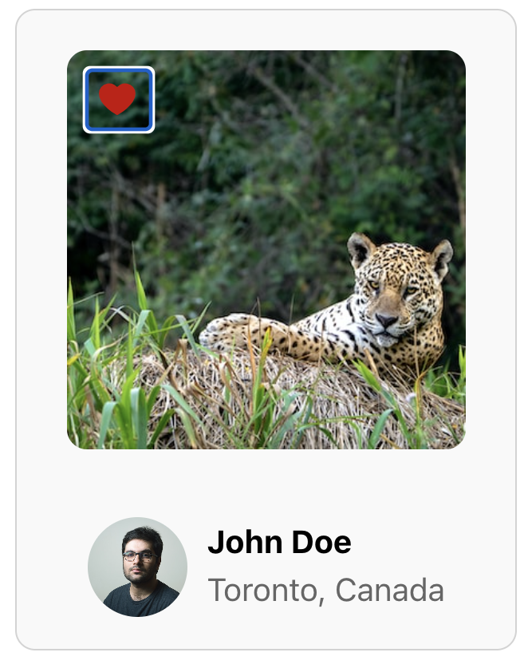
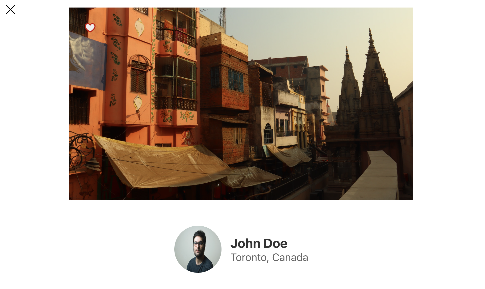
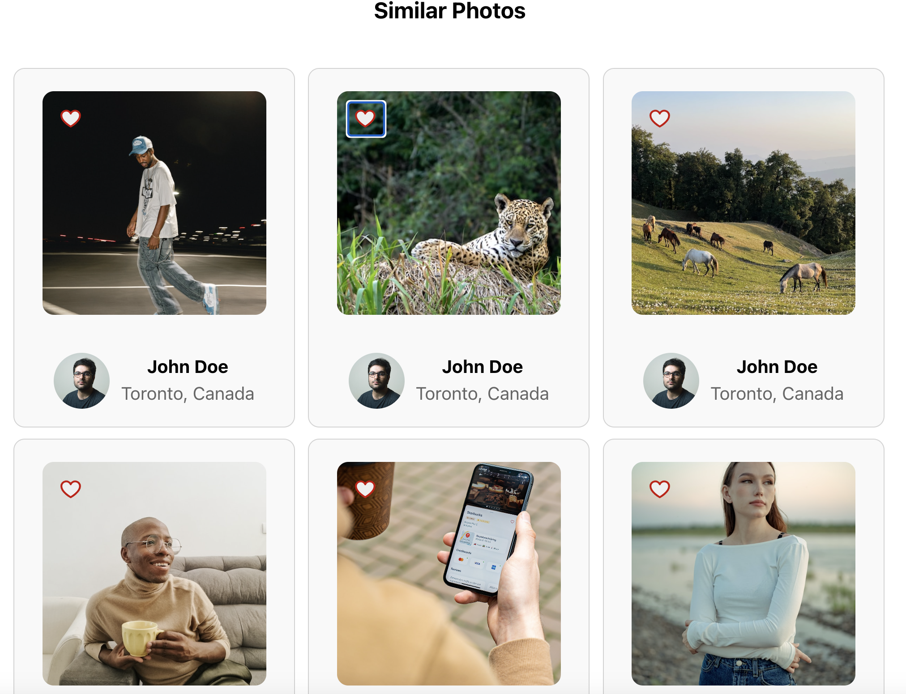

# react-photolabs

The PhotoLabs project for the Web Development React course programming.

# Photolabs Description

Photolabs is a React based project for displaying photos on a webpage.

## Setup

Install dependencies with `npm install` in each respective `/frontend` and `/backend`.

## [Frontend] Running Webpack Development Server

```sh
cd frontend
npm start
```

## [Backend] Running Backend Servier

Read `backend/readme` for further setup details.

```sh
cd backend
npm start
```

## Screen Shots

Home Page



Nav Bar



Favorited Picture



Modal Main Picture



Similar Photos Gallery


